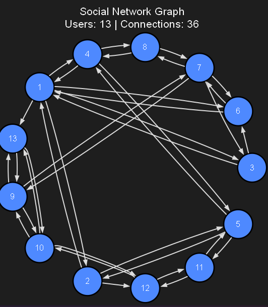

# XML-Social-Network-Analyzer


XML Social Network Analyzer is a comprehensive desktop application that parses, analyzes, and visualizes social network data stored in XML files. It provides a wide range of features for manipulating XML data, including validation, formatting, compression, and conversion to JSON. Additionally, the application offers powerful tools for analyzing and visualizing user relationships as a directed graph, identifying influencers, mutual followers, and suggesting connections.

## Table of Contents
- [Description](#description)
- [Demo Video](#demo-video)
- [Built With](#built-with)
- [Project Structure](#project-structure)
- [Features](#features)
    - [XML Processing](#xml-processing)
    - [Graph Visualization](#graph-visualization)
    - [Network Analysis](#network-analysis)
    - [Search](#search)
- [Installation](#installation)
- [Usage](#usage)
    - [GUI Mode](#gui-mode)
    - [CLI Mode](#cli-mode)
- [API Documentation](#api-documentation)
- [Troubleshooting](#troubleshooting)
- [Team Members](#team-members)
- [Contributing](#contributing)
- [License](#license)

## Description

This application acts as both a robust XML editor and a social network analysis tool. Whether you need to fix malformed XML, minify a file for production, or explore the intricate connections between users in a social network, XML-Social-Network-Analyzer has you covered.

 <!-- Main Application Window -->

## Demo Video

[Watch the Demo Video](https://github.com/user-attachments/assets/3feee4ce-2742-4cc5-8aa2-45d700f5e1cc)


## Built With

*   **Language**: C++
*   **GUI Framework**: Qt 6.5
*   **Build System**: CMake
*   **Visualization**: Graphviz

## Project Structure

```text
src
├── CLI             # Command-Line Interface logic
├── UI              # User Interface implementation
│   └── pages       # Individual pages for the GUI application
├── app             # Application entry points (Main, GUI, CLI)
└── core            # Core logic (XML operations, Graph algorithms, Search, etc.)
```

## Features

### XML Processing
*   **Validation**: Ensures XML files are well-formed. Detects errors such as unclosed tags and structural inconsistencies.
*   **Error Correction**: Automatically fixes detectable errors in XML files.
*   **Formatting (Prettifying)**: Indents nested elements and adds newlines to make XML readable.
*   **Minification**: Removes unnecessary whitespace and newlines to reduce file size.
*   **JSON Conversion**: Converts XML data to JSON format for compatibility with modern web tools.
*   **Compression**: Uses Byte Pair Encoding (BPE) to compress XML text files efficiently.
*   **Decompression**: Restores compressed `.comp` files back to their original XML format.

### Graph Visualization
*   **Graph Representation**: Visualizes user relationships as a directed graph where nodes are users and edges are follows.
*   **Interactive View**: Explore the network visually.

 <!-- Graph View -->


### Network Analysis
*   **Influential Users**: Identifies users with the most followers (highest in-degree).
*   **Active Users**: Identifies users who follow the most people (highest out-degree).
*   **Mutual Followers**: Finds users followed by a set of given users.
*   **Follow Suggestions**: Suggests new friends based on "friends of friends" logic.


### Search
*   **Keyword Search**: Find posts containing specific words.
*   **Topic Search**: Find posts related to specific topics using text analysis.

## Installation

### Installer
You can download the latest installer directly from our [Releases Page](https://github.com/amr10w/ILoveXML/releases/latest).

1.  Go to the **[Releases Page](https://github.com/amr10w/ILoveXML/releases/latest)**.
2.  Scroll down to the **Assets** section.
3.  Click on **`ilovexml_installer.exe`** to download it.
4.  Run the installer and follow the instructions to set up the app.

> **Note:** If you are a developer and want to inspect the code, you can download `Source code (zip)` instead.

### Build from Source
If you prefer to build the project yourself using VS Code, Qt, and CMake, please refer to our detailed guide:

[**How to Build & Run the Project**](guides/BUILD_AND_RUN.md)

## Usage

### GUI Mode
Simply run the installed executable or the built target to launch the graphical interface. The GUI provides intuitive buttons for all operations, file browsing, and visualization.

### CLI Mode
The application can be run in Command Line Interface mode for automation or headless environments.

> **Note:** If you installed the app using the installer, you can run commands directly in CMD or PowerShell using `ilovexml` (without `.exe`) from any location.

#### Validate XML
```bash
# Check consistency
ilovexml verify -i input.xml

# Fix errors and save
ilovexml verify -i input.xml -f -o fixed.xml
```

#### Format (Prettify)
```bash
ilovexml format -i input.xml -o output.xml
```

#### Minify
```bash
ilovexml mini -i input.xml -o output.xml
```

#### Convert to JSON
```bash
ilovexml json -i input.xml -o output.json
```

#### Compress & Decompress
```bash
# Compress
ilovexml compress -i data.xml -o data.comp

# Decompress
ilovexml decompress -i data.comp -o restored.xml
```

#### Network Analysis
```bash
# Most Active User
ilovexml most_active -i data.xml

# Most Influential User
ilovexml most_influencer -i data.xml

# Mutual Followers (comma-separated IDs)
ilovexml mutual -i data.xml -ids 1,2,3

# Suggest Friends
ilovexml suggest -i data.xml -id 1
```

#### Search
```bash
# Search by Word
ilovexml search -w "keyword" -i data.xml

# Search by Topic
ilovexml search -t "topic" -i data.xml
```

#### Visualize
```bash
ilovexml draw -i data.xml -o graph.png
```

## API Documentation

**[View Complete API Documentation](https://amr10w.github.io/ILoveXML/index.html)**

Explore the comprehensive API documentation with:
- **Advanced Search** - Search for any function, method, or class
- **Detailed References** - Complete documentation for all modules
- **Interactive UI** - Smooth navigation with enhanced visuals

## Troubleshooting

-   **Common XML Parsing Errors**: If validation fails mysteriously, check for hidden characters or encoding issues in your XML file. Ensure the file starts with a valid XML declaration.
-   **Qt Path Issues**: If building from source fails, ensure your Qt kit is correctly selected in VS Code (CMake Tools extension) and that the Qt bin directory is in your system PATH if running outside the deployed environment.

## Team Members

| Name | GitHub Account |
| :--- | :--- |
| **Amr Ahmed** | [amr10w](https://github.com/amr10w) |
| **Ali Ahmed** | [aliabdelmaboud](https://github.com/aliabdelmaboud) |
| **Mohamed Hamouda** | [m-e-9991](https://github.com/m-e-9991) |
| **Omar Mohamed** | [Omarzcode](https://github.com/Omarzcode) |
| **Ammar Mohamed** | [ammar-abdelghany30](https://github.com/ammar-abdelghany30) |
| **Hamza Basem** | [Hamza-Eldefrawy](https://github.com/Hamza-Eldefrawy) |
| **Anas Ayman** | [Anas-Elsab3](https://github.com/Anas-Elsab3) |
| **Ahmed Ezzat** | [Labolabo-1](https://github.com/Labolabo-1) |
| **Ahmed Ramadan** | [ahmedramadan2025](https://github.com/ahmedramadan2025) |

## Contributing

1.  Fork the repository.
2.  Create a new branch for your feature (`git checkout -b feature/NewFeature`).
3.  Commit your changes (`git commit -m 'Add new feature'`).
4.  Push to the branch (`git push origin feature/NewFeature`).
5.  Open a Pull Request.

## License

This project is licensed under the MIT License. See the [LICENSE](https://github.com/amr10w/ILoveXML/blob/docs/update-readme/LICENSE) file for more details.
