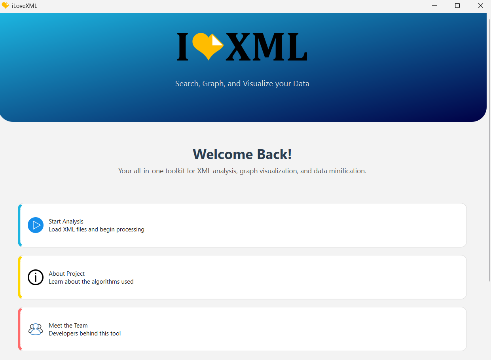
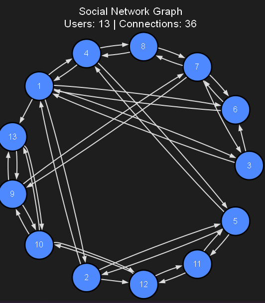

# XML-Social-Network-Analyzer

<div align="center">


**A powerful desktop application for parsing, analyzing, and visualizing social network data stored in XML files.**

[Features](#features) • [Quick Start](#quick-start) • [Installation](#installation) • [Documentation](#api-documentation) • [Contributing](#contributing)



</div>

---

<a name="table-of-contents"></a>
## 📋 Table of Contents

- [Overview](#overview)
- [Quick Start](#quick-start)
- [Demo Video](#demo-video)
- [Features](#features)
  - [XML Processing](#xml-processing)
  - [Graph Visualization](#graph-visualization)
  - [Network Analysis](#network-analysis)
  - [Search](#search)
- [Prerequisites](#prerequisites)
- [Installation](#installation)
  - [Installer (Recommended)](#installer-recommended)
  - [Build from Source](#build-from-source)
- [Usage](#usage)
  - [GUI Mode](#gui-mode)
  - [CLI Mode](#cli-mode)
- [Input Format](#input-format)
- [API Documentation](#api-documentation)
- [Project Structure](#project-structure)
- [Performance and Limitations](#performance-and-limitations)
- [Troubleshooting](#troubleshooting)
- [Changelog](#changelog)
- [Team Members](#team-members)
- [Contributing](#contributing)
- [License](#license)

---

<a name="overview"></a>
## 🌟 Overview

XML Social Network Analyzer is a comprehensive desktop application that parses, analyzes, and visualizes social network data stored in XML files. It provides a wide range of features for manipulating XML data, including validation, formatting, compression, and conversion to JSON. Additionally, the application offers powerful tools for analyzing and visualizing user relationships as a directed graph, identifying influencers, mutual followers, and suggesting connections.

Whether you need to fix malformed XML, minify a file for production, or explore the intricate connections between users in a social network, XML-Social-Network-Analyzer has you covered.

### ✨ Key Highlights

- 🔍 **XML Validation & Auto-Correction** — Detect and fix malformed XML automatically
- 📊 **Graph Visualization** — Interactive directed graph representation of social networks
- 🎯 **Network Analysis** — Identify influencers, mutual followers, and get friend suggestions
- 🔄 **Format Conversion** — Convert XML to JSON seamlessly
- 📦 **Compression** — Efficient Byte Pair Encoding (BPE) compression
- 🖥️ **Dual Interface** — Both GUI and CLI support

---

<a name="quick-start"></a>
## ⚡ Quick Start

Get up and running in **60 seconds**:

```bash
# 1. Download the installer from releases
# https://github.com/amr10w/ILoveXML/releases/latest

# 2. Run the installer and follow the setup wizard

# 3. Start analyzing!
ilovexml verify -i your_network.xml        # Validate XML
ilovexml draw -i your_network.xml -o graph.png  # Visualize network
ilovexml most_influencer -i your_network.xml    # Find top influencer
```

Or simply launch the GUI and drag & drop your XML file!

---

<a name="demo-video"></a>
## 🎬 Demo Video

<div align="center">

[Watch the Demo Video](https://github.com/user-attachments/assets/3feee4ce-2742-4cc5-8aa2-45d700f5e1cc)

</div>

---

<a name="features"></a>
## 🚀 Features

<a name="xml-processing"></a>
### XML Processing

| Feature | Description |
|---------|-------------|
| ✅ **Validation** | Ensures XML files are well-formed. Detects unclosed tags and structural inconsistencies |
| 🔧 **Error Correction** | Automatically fixes detectable errors in XML files |
| 📝 **Formatting** | Indents nested elements and adds newlines for readability |
| 📦 **Minification** | Removes unnecessary whitespace to reduce file size |
| 🔄 **JSON Conversion** | Converts XML data to JSON format for web compatibility |
| 🗜️ **Compression** | Uses Byte Pair Encoding (BPE) for efficient compression |
| 📂 **Decompression** | Restores `.comp` files back to original XML format |

<a name="graph-visualization"></a>
### Graph Visualization

<div align="center">



</div>

- **Graph Representation**: Visualizes user relationships as a directed graph where nodes are users and edges represent follow relationships
- **Interactive View**: Pan, zoom, and explore the network visually
- **Export Options**: Save graphs as PNG, SVG, or PDF

<a name="network-analysis"></a>
### Network Analysis

| Analysis | Description |
|----------|-------------|
| 👑 **Influential Users** | Identifies users with the most followers (highest in-degree) |
| 🏃 **Active Users** | Identifies users who follow the most people (highest out-degree) |
| 🤝 **Mutual Followers** | Finds users followed by a set of given users |
| 💡 **Follow Suggestions** | Suggests new friends based on "friends of friends" logic |

<a name="search"></a>
### Search

- 🔍 **Keyword Search**: Find posts containing specific words
- 🏷️ **Topic Search**: Find posts related to specific topics using text analysis

---

<a name="prerequisites"></a>
## 📋 Prerequisites

Before installation, ensure you have the following:

### For Using the Installer (End Users)

| Requirement | Version | Notes |
|-------------|---------|-------|
| **Operating System** | Windows 10/11 | 64-bit required |
| **Graphviz** | 2.50+ | Required for graph visualization |

### For Building from Source (Developers)

| Requirement | Version | Notes |
|-------------|---------|-------|
| **Operating System** | Windows 10/11 | 64-bit required |
| **C++ Compiler** | MSVC 2019+ / MinGW-w64 | C++17 support required |
| **Qt Framework** | 6.5+ | [Download Qt](https://www.qt.io/download) |
| **CMake** | 3.16+ | [Download CMake](https://cmake.org/download/) |
| **Graphviz** | 2.50+ | [Download Graphviz](https://graphviz.org/download/) |
| **Git** | Latest | For cloning the repository |

### Installing Graphviz

```bash
# Windows (using Chocolatey)
choco install graphviz

# Windows (using winget)
winget install graphviz

# Or download directly from https://graphviz.org/download/
```

> ⚠️ **Important**: After installing Graphviz, ensure its `bin` directory is added to your system PATH.

---

<a name="installation"></a>
## 📥 Installation

<a name="installer-recommended"></a>
### Installer (Recommended)

The easiest way to get started:

1. Go to the **[Releases Page](https://github.com/amr10w/ILoveXML/releases/latest)**
2. Download **`ilovexml_installer.exe`** from the Assets section
3. Run the installer and follow the setup wizard
4. Launch from Start Menu or run `ilovexml` from any terminal

> ✅ The installer automatically configures PATH and registers file associations.

<a name="build-from-source"></a>
### Build from Source

<details>
<summary>Click to expand build instructions</summary>

#### 1. Clone the Repository

```bash
git clone https://github.com/amr10w/ILoveXML.git
cd ILoveXML
```

#### 2. Configure with CMake

```bash
mkdir build && cd build
cmake .. -DCMAKE_PREFIX_PATH="C:/Qt/6.5.0/msvc2019_64"
```

#### 3. Build

```bash
cmake --build . --config Release
```

#### 4. Run

```bash
./Release/ilovexml.exe
```

For detailed build instructions, see: [**BUILD_AND_RUN.md**](guides/BUILD_AND_RUN.md)

</details>

---

<a name="usage"></a>
## 📖 Usage

<a name="gui-mode"></a>
### GUI Mode

Launch the application via:
- Start Menu shortcut (if installed)
- Double-clicking the executable
- Running `ilovexml` without arguments

The GUI provides:
- Drag & drop file loading
- Tabbed interface for different operations
- Real-time preview of changes
- One-click export options

<a name="cli-mode"></a>
### CLI Mode

Perfect for automation, scripting, and headless environments.

> 💡 **Tip**: If installed via the installer, `ilovexml` is available globally in your terminal.

#### Command Reference

<details>
<summary><b>XML Validation & Correction</b></summary>

```bash
# Validate XML file
ilovexml verify -i input.xml

# Validate and fix errors
ilovexml verify -i input.xml -f -o fixed.xml
```

**Output Example:**
```
✓ XML is valid
  - Elements: 156
  - Depth: 4
  - Users found: 23
```

</details>

<details>
<summary><b>Formatting & Minification</b></summary>

```bash
# Prettify XML (add indentation)
ilovexml format -i input.xml -o formatted.xml

# Minify XML (remove whitespace)
ilovexml mini -i input.xml -o minified.xml
```

</details>

<details>
<summary><b>Conversion</b></summary>

```bash
# Convert to JSON
ilovexml json -i input.xml -o output.json
```

</details>

<details>
<summary><b>Compression</b></summary>

```bash
# Compress XML file
ilovexml compress -i data.xml -o data.comp

# Decompress back to XML
ilovexml decompress -i data.comp -o restored.xml
```

**Compression Stats:**
```
Original:   1,245 KB
Compressed:   312 KB
Ratio:      74.9% reduction
```

</details>

<details>
<summary><b>Network Analysis</b></summary>

```bash
# Find most active user (follows the most people)
ilovexml most_active -i data.xml

# Find most influential user (most followers)
ilovexml most_influencer -i data.xml

# Find mutual followers between users
ilovexml mutual -i data.xml -ids 1,2,3

# Get friend suggestions for a user
ilovexml suggest -i data.xml -id 1
```

**Example Output:**
```
Most Influential User:
  ID: 42
  Name: John Doe
  Followers: 1,247
  Following: 89
```

</details>

<details>
<summary><b>Search</b></summary>

```bash
# Search posts by keyword
ilovexml search -w "technology" -i data.xml

# Search posts by topic
ilovexml search -t "programming" -i data.xml
```

</details>

<details>
<summary><b>Visualization</b></summary>

```bash
# Generate network graph
ilovexml draw -i data.xml -o graph.png

# Specify output format
ilovexml draw -i data.xml -o graph.svg --format svg
```

</details>

#### Complete CLI Reference

```bash
ilovexml --help
```

```text
Usage: ilovexml <command> [options]

Commands:
  verify      Validate XML file
  format      Prettify XML with indentation
  mini        Minify XML file
  json        Convert XML to JSON
  compress    Compress XML using BPE
  decompress  Decompress .comp file
  most_active     Find most active user
  most_influencer Find most influential user
  mutual      Find mutual followers
  suggest     Suggest friends for user
  search      Search posts
  draw        Generate network graph

Options:
  -i, --input     Input file path (required)
  -o, --output    Output file path
  -f, --fix       Auto-fix errors (verify only)
  -id             User ID (suggest only)
  -ids            Comma-separated user IDs (mutual only)
  -w, --word      Search keyword
  -t, --topic     Search topic
  -h, --help      Show help message
  -v, --version   Show version
```

---

<a name="input-format"></a>
## 📄 Input Format

### Expected XML Schema

The application expects XML files following this structure:

```xml
<?xml version="1.0" encoding="UTF-8"?>
<users>
    <user>
        <id>1</id>
        <name>John Doe</name>
        <posts>
            <post>
                <body>Hello world! #greeting</body>
                <topics>
                    <topic>greeting</topic>
                    <topic>introduction</topic>
                </topics>
            </post>
        </posts>
        <followers>
            <follower>
                <id>2</id>
            </follower>
            <follower>
                <id>3</id>
            </follower>
        </followers>
    </user>
    <user>
        <id>2</id>
        <name>Jane Smith</name>
        <posts>
            <post>
                <body>Learning XML parsing today!</body>
                <topics>
                    <topic>programming</topic>
                    <topic>xml</topic>
                </topics>
            </post>
        </posts>
        <followers>
            <follower>
                <id>1</id>
            </follower>
        </followers>
    </user>
</users>
```

### Schema Details

| Element | Required | Description |
|---------|----------|-------------|
| `users` | ✅ | Root element containing all users |
| `user` | ✅ | Individual user container |
| `id` | ✅ | Unique numeric identifier |
| `name` | ✅ | User's display name |
| `posts` | ❌ | Container for user's posts |
| `post` | ❌ | Individual post |
| `body` | ❌ | Post content |
| `topics` | ❌ | Container for post topics |
| `topic` | ❌ | Individual topic tag |
| `followers` | ❌ | Container for follower relationships |
| `follower` | ❌ | Individual follower reference |

### Sample Files

Sample XML files are available in the [`samples/`](samples/) directory:
- `small_network.xml` — 10 users, good for testing
- `medium_network.xml` — 100 users
- `large_network.xml` — 1,000 users

---

<a name="api-documentation"></a>
## 📚 API Documentation

<div align="center">

**[📖 View Complete API Documentation](https://amr10w.github.io/ILoveXML/index.html)**

</div>

Explore the comprehensive API documentation featuring:
- 🔍 **Advanced Search** — Search for any function, method, or class
- 📋 **Detailed References** — Complete documentation for all modules
- 🎨 **Interactive UI** — Smooth navigation with enhanced visuals
- 📊 **Class Diagrams** — Visual representation of code structure

### Key Classes

| Class | Description |
|-------|-------------|
| `XMLParser` | Core XML parsing and validation |
| `XMLFormatter` | Formatting and minification |
| `Graph` | Directed graph data structure |
| `NetworkAnalyzer` | Social network analysis algorithms |
| `GraphVisualizer` | Graphviz integration |
| `BPECompressor` | Byte Pair Encoding compression |

---

<a name="project-structure"></a>
## 📁 Project Structure

```text
ILoveXML/
├── 📂 src/
│   ├── 📂 CLI/              # Command-Line Interface logic
│   │   ├── cli_parser.cpp
│   │   └── cli_parser.h
│   ├── 📂 UI/               # User Interface implementation
│   │   ├── 📂 pages/        # Individual GUI pages
│   │   │   ├── editor_page.cpp
│   │   │   ├── graph_page.cpp
│   │   │   └── analysis_page.cpp
│   │   ├── mainwindow.cpp
│   │   └── mainwindow.h
│   ├── 📂 app/              # Application entry points
│   │   ├── main.cpp
│   │   └── application.cpp
│   └── 📂 core/             # Core logic
│       ├── xml_parser.cpp
│       ├── xml_formatter.cpp
│       ├── graph.cpp
│       ├── network_analyzer.cpp
│       ├── bpe_compressor.cpp
│       └── search_engine.cpp
├── 📂 guides/               # Documentation and guides
│   ├── BUILD_AND_RUN.md
│   └── 📂 images/
├── 📂 samples/              # Sample XML files
├── 📂 tests/                # Unit tests
├── 📄 CMakeLists.txt
├── 📄 LICENSE
└── 📄 README.md
```

---

<a name="performance-and-limitations"></a>
## ⚡ Performance & Limitations

### Performance Benchmarks

Tested on Windows 11, Intel i7-12700H, 16GB RAM:

| Operation | 1K Users | 10K Users | 100K Users |
|-----------|----------|-----------|------------|
| Parse XML | 12ms | 89ms | 1.2s |
| Validate | 8ms | 67ms | 0.9s |
| Format | 15ms | 120ms | 1.5s |
| Minify | 10ms | 78ms | 1.1s |
| JSON Convert | 18ms | 145ms | 1.8s |
| Graph Render | 45ms | 2.1s | 25s |
| Find Influencer | 5ms | 35ms | 0.4s |

### Known Limitations

| Limitation | Details |
|------------|---------|
| **Max File Size** | Recommended < 500MB for optimal performance |
| **Max Users** | Graph visualization may slow down beyond 50K nodes |
| **Encoding** | Only UTF-8 encoded XML files are supported |
| **Platform** | Currently Windows-only (Linux/macOS planned) |
| **XML Version** | Only XML 1.0 is fully supported |

### Memory Usage

- Base application: ~50MB
- Per 1K users loaded: ~5MB additional
- Graph visualization: ~10MB per 1K nodes

---

<a name="troubleshooting"></a>
## 🔧 Troubleshooting

<details>
<summary><b>XML Parsing Errors</b></summary>

**Problem**: Validation fails with cryptic errors

**Solutions**:
1. Check for hidden characters (BOM, zero-width spaces)
2. Ensure UTF-8 encoding without BOM
3. Verify XML declaration: `<?xml version="1.0" encoding="UTF-8"?>`
4. Use a hex editor to inspect the first bytes

</details>

<details>
<summary><b>Graph Not Rendering</b></summary>

**Problem**: Graph visualization shows blank or errors

**Solutions**:
1. Verify Graphviz is installed: `dot -V`
2. Check Graphviz is in PATH
3. Ensure output directory is writable
4. Try a smaller dataset first

</details>

<details>
<summary><b>Qt/Build Issues</b></summary>

**Problem**: CMake can't find Qt or build fails

**Solutions**:
1. Verify Qt installation path
2. Set `CMAKE_PREFIX_PATH` correctly
3. Ensure compiler matches Qt build (MSVC vs MinGW)
4. Check Qt kit selection in VS Code

</details>

<details>
<summary><b>CLI Command Not Found</b></summary>

**Problem**: `ilovexml` not recognized in terminal

**Solutions**:
1. Restart terminal after installation
2. Manually add install directory to PATH
3. Use full path: `"C:\Program Files\ILoveXML\ilovexml.exe"`

</details>

<details>
<summary><b>Out of Memory</b></summary>

**Problem**: Application crashes with large files

**Solutions**:
1. Close other applications
2. Process file in chunks (CLI)
3. Use 64-bit version
4. Increase virtual memory

</details>

---

<a name="changelog"></a>
## 📝 Changelog

### v1.0.0 (2024-01-15)

🎉 **Initial Release**

- XML validation with auto-correction
- Formatting and minification
- JSON conversion
- BPE compression/decompression
- Graph visualization with Graphviz
- Network analysis (influencers, active users, mutual followers)
- Friend suggestion algorithm
- Keyword and topic search
- Full GUI and CLI support
- Windows installer

### Planned Features (v1.1.0)

- [ ] Linux and macOS support
- [ ] Dark mode theme
- [ ] Export analysis reports (PDF)
- [ ] Batch processing mode
- [ ] Plugin system
- [ ] Real-time collaboration

---

<a name="team-members"></a>
## 👥 Team Members

<div align="center">

| Avatar | Name | GitHub | Role |
|--------|------|--------|------|
|  | **Amr Ahmed** | [@amr10w](https://github.com/amr10w) | Project Lead |
|  | **Ali Ahmed** | [@aliabdelmaboud](https://github.com/aliabdelmaboud) | Core Developer |
|  | **Mohamed Hamouda** | [@m-e-9991](https://github.com/m-e-9991) | Core Developer |
|  | **Omar Mohamed** | [@Omarzcode](https://github.com/Omarzcode) | Core Developer |
|  | **Ammar Mohamed** | [@ammar-abdelghany30](https://github.com/ammar-abdelghany30) | Core Developer |
|  | **Hamza Basem** | [@Hamza-Eldefrawy](https://github.com/Hamza-Eldefrawy) | Core Developer |
|  | **Anas Ayman** | [@Anas-Elsab3](https://github.com/Anas-Elsab3) | Core Developer |
|  | **Ahmed Ezzat** | [@Labolabo-1](https://github.com/Labolabo-1) | Core Developer |
|  | **Ahmed Ramadan** | [@ahmedramadan2025](https://github.com/ahmedramadan2025) | Core Developer |

</div>

---

<a name="contributing"></a>
## 🤝 Contributing

We welcome contributions! Here's how to get started:

### Quick Steps

1. **Fork** the repository
2. **Clone** your fork:
   ```bash
   git clone https://github.com/YOUR_USERNAME/ILoveXML.git
   ```
3. **Create** a feature branch:
   ```bash
   git checkout -b feature/amazing-feature
   ```
4. **Make** your changes
5. **Test** thoroughly
6. **Commit** with a clear message:
   ```bash
   git commit -m "feat: add amazing feature"
   ```
7. **Push** to your fork:
   ```bash
   git push origin feature/amazing-feature
   ```
8. **Open** a Pull Request

### Commit Convention

We follow [Conventional Commits](https://www.conventionalcommits.org/):

| Type | Description |
|------|-------------|
| `feat` | New feature |
| `fix` | Bug fix |
| `docs` | Documentation only |
| `style` | Code style (formatting) |
| `refactor` | Code refactoring |
| `test` | Adding tests |
| `chore` | Maintenance tasks |

### Code Style

- Use consistent indentation (4 spaces)
- Follow Qt naming conventions
- Document public APIs
- Write unit tests for new features

---

<a name="license"></a>
## 📄 License

<div align="center">

This project is licensed under the **MIT License**.

See the [LICENSE](LICENSE) file for details.

---

**Made with ❤️ by the ILoveXML Team**

[⬆ Back to Top](#table-of-contents)

</div>
